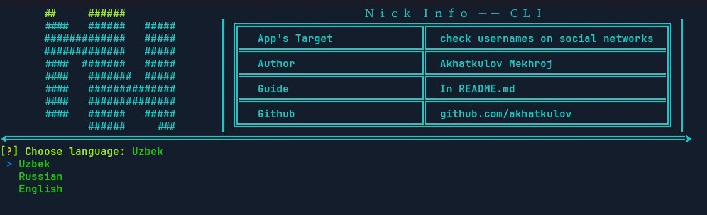

<b align="center"> <h1> 💎NickInfo - CLI </h1> </b>

App's Target: You can check your username. Is your name busy or empty?

  
<h1 id="apps"> Other views of the program </h1>
<b>Telegram Bot:</b> <a href="https://t.me/NickInfo-Bot"> LINK </a>  
<b>Web Site:</b> <a href="https://nick-info.uz"> LINK </a>  

<h1>💡Questions:</h1>
<h3><a href="https://github.com/akhatkulov/NickInfo-CLI#install">How to install?</a></h3>
<h3><a href="https://github.com/akhatkulov/NickInfo-CLI#use">How to use?</a></h3>
<h3><a href="https://github.com/akhatkulov/NickInfo-CLI#social">Which social networks it checks?</a></h3>
<h3><a href="https://github.com/akhatkulov/NickInfo-CLI#lang">What languages ​​does the program work in?</a></h3>

<h1 id="install">📁	How to install?</h1>
<h3>There are two ways to install the program:</h3>
<h4>➖The first way: </h4> 
<pre>
git clone https://github.com/akhatkulov/NickInfo-CLI.git
cd InstaCracker-CLI
python3 setup.py
</pre>
<h4>➖The second way:</h4>
<pre>
git clone https://github.com/akhatkulov/NickInfo-CLI.git
cd InstaCracker-CLI
</pre>
<h4>➖and install this libraries:</h4>
<pre>
┎  Libraries
╏
╔  Typer
╠  Colorama
╠  httpx
╠  Requests
╠  Inquirer
╚  Tabulate
</pre>

<h1 id="use"> 📋How to use? </h1>
<h5 id="lang">📌It's very easy to use just run app.py and keep using it, if you have trouble using the CLI you can use the app in other views. Apps-><a href="https://github.com/akhatkulov/NickInfo-CLI#apps">LINK</a></h5>
Run:<code>python3 app.py</code>

<b id="social">
This program checks about 70 social networks.

For example: vk,ello,facebook, pinterest, hackerone, okcupid
</b>
<b id="lang"> System languages</b>
<pre>
┎  Sytem languages
╏
╔  uz (Uzbek)
╠  ru (Russian)
╚  en (English)
</pre>
<h2>🔥I'm glad you found my program useful, if you have any questions, please contact me!</h2>
<!-- <h2> Community for questions: <a href="https://t.me/+tmN2hmIaT1EwNjQy">LINK</a> </h2> -->
<h2>📩Contact: <a href="https://t.me/akhatkulov">LINK</a></h2>
   
